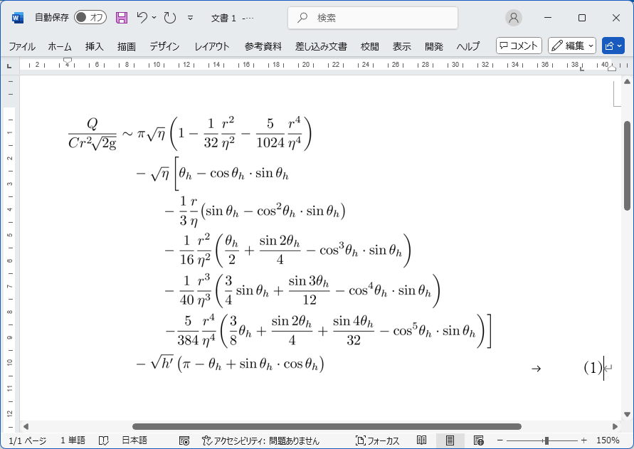
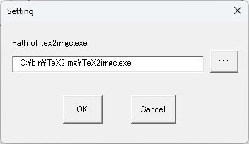
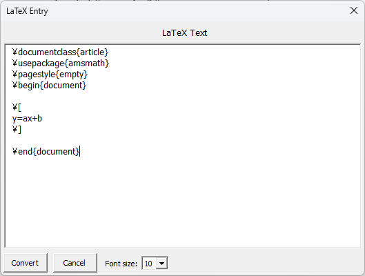
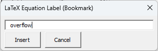

# IguanaDoc

## 概　要 

&emsp;IguanaDoc.dotm は $\LaTeX$ で粗飯した数式の画像ファイルを Microsoft Word の文書の Shape オブジェクトに変換して文中に挿入する機能を実装した Microsoft Word マクロ有効テンプレートである．  
&emsp;マクロは EngineeroLabs の Engineero Nathan が GPL ライセンスで公開している git リポジトリ [latex_in_word](https://github.com/EngineeroLabs/latex_in_word) 内に含まれている latex_in_word_2010.docm を編集して，サーバーとの交信で取得している数式の画像ファイルを Yusuke Terada and Noriyuki Abe が開発した [Tex2img](https://tex2img.tech/)  で生成されるそれに変更している．  
&emsp;テンプレート名は同様の機能を Microsoft PowerPoint においてより高度に実装している [IganaTeX](https://www.jonathanleroux.org/software/iguanatex/) にあやかった．

    

## 事前準備 
 
### $\LaTeX$ 関連

&emsp;以下が必要である．

* W32TeX，TeX Live 等がインストール済みで $\LaTeX$  の実行環境が整っていること
* 第 9 版以降の Gostscrupt がインストールされていること
 
### Tex2img のインストール

&emsp;Tex2img をインストールする．
念のため GUI 付きのアプリケーション Tex2img.exe を実行して上記の $\LaTeX$ 関連の設定が整っていることを確認する．

### IganaDoc.dotm のコピー

&emsp;IganaDoc.dotm を %APPDATA%\Microsoft\Word\STARTUP にコピーする． 
&emsp;このテンプレートは $\LaTeX$ を使わない文書でも常時組み込まれることになるので，無用になった場合は必要に応じて上記のディレクトリから削除する．
 
### 実行方法 

#### TeX2imgc.exe のパスの指定 

&emsp;**Alt+s** をタイプして表示される下のフォームに TeX2imgc.exe（TeX2img<u>c</u> であることに注意）の絶対パスを入力する．
三点リーダーのボタンをクリックして表示されるダイヤログを用いることもできる． 
&emsp;新規に文書を作成する場合は最初に実行しなければならない．

    

#### 数式の入力 

&emsp;新規の入力の場合はカーソルで **Alt+l** をタイプするとサンプルのスクリプトを含む下図の画面が表示される．
所望のスクリプトに変更して Convert ボタンをクリックするとコマンドプロンプトのウィーンが表示され生成したイメージが画面に表示される． 
&emsp;また既存のイメージを選択して同様の操作を行うと入力時のスクリプトが再表示されるので必要があれば修正してイメージを再生成する．
&emsp;スクリプトはコピーしたイメージにも継承されるので一部変更する場合に有用である．

    

 
##### 数式番号の入力 

&emsp;数式番号を入力する行にルーラー（∟）を設けて tab をタイプしてカーソルを移動したうえで **Alt+n** をタイプすると下図の画面が表示される．
適当なラベルを入力して Insert ボタンをクリックすると，式番号が付与されブックマークに登録される．
この行以前に数式を新規入力した場合には式番号が更新される． 
 

    

## ライセンス

&emsp;[latex_in_word](https://github.com/EngineeroLabs/latex_in_word) に準じて GNU GPL v2 で公開します．